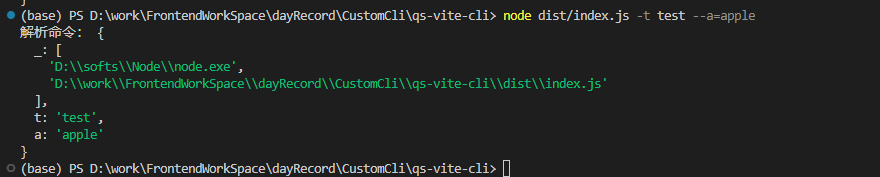
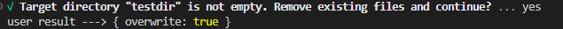
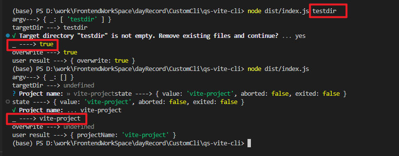
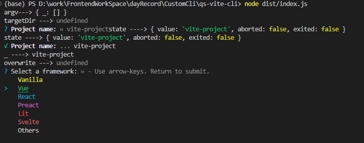
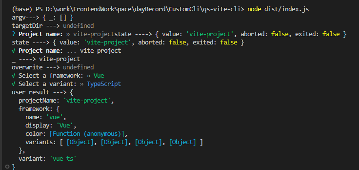
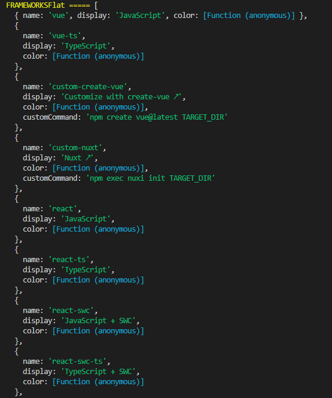
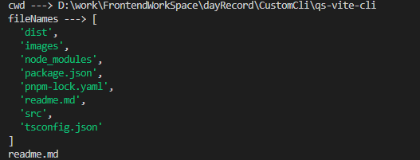
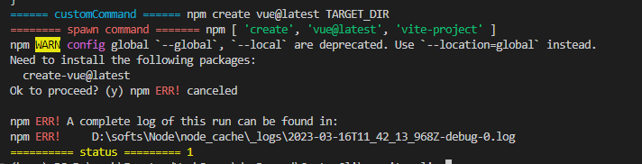
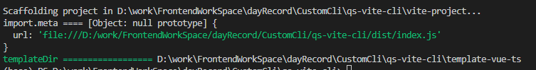
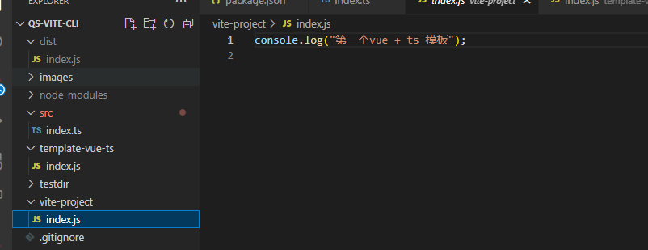

# qs-vite

个人学习 create-vite 记录

## 坑

1. types 文件，create-vite 的 package.json 中不含 types 文件，但是它的父文件中其实引入了。

2. ~~自己编写时，package.json 中不要加 `type: "module"` 要不然你无法在 node 环境下执行 ts-node \*.ts 文件，会报 `TypeError [ERR_UNKNOWN_FILE_EXTENSION]: Unknown file extension “.ts“`,改成`type: "commonjs"`~~
   源码用 ts 写，要运行时，先使用`tsc`将 ts 编译成 js，执行 js 文件即可。
3. tsconfig.json

   ```json
   {
     "compilerOptions": {
       // 这个配置必开
       "moduleResolution": "node"
     }
   }
   ```

## minimist

命令行解析工具

```js
const argv = minimist<{
  t?: string;
  template?: string;
}>(process.argv.slice(2), { string: ["_"] });
```



执行命令 `node dist/index.js -t test --a=apple`

argv 结构说明：

```js
{
  _: ["本地node的地址", "当前执行命令所在地址"]
  ...其余命令行参数
}
```

- `process.argv.slice(2)` 提取命令行参数

- argv 最终结果 `{ _: [], t: 'test', a: 'apple' }`

  `_` 接收于选项参数无关的命令，并且是 string 类型

  

## prompts

用户交互

```js
// result的类型接口限定， 接口定义了哪些类型，prompts里就得写几个步骤
let result: prompts.Answers<"projectName" | "overwrite" | "packageName" | "framework" | "variant">;

try {
        result = await prompts(
      [
        {
          type: argTargetDir ? null : "text",
          name: "projectName",
          message: "Project name:",
          initial: defaultTargetDir,
          onState: (state) => {
            targetDir = formatTargetDir(state.value) || defaultTargetDir;
          },
        },
        ...
      ],
      {
        onCancel: () => {
          throw new Error("X" + " Operation cancelled");
        },
      }
    );
} catch (cancleled: any) {
    // 用户取消时输出
    console.log(cancelled.message);
    return;
}
```


```js
type: () => (!fs.existsSync(targetDir) || isEmpty(targetDir) ? null : "confirm");
```





```js
{
  // 用户定义了模板并且是内部提供的模板就跳过，否则就需要用户选择一下使用哪个框架
  type: argTemplate && TEMPLATES.includes(argTemplate) ? null : "select",
  name: "framework",
  message:
    typeof argTemplate === "string" && !TEMPLATES.includes(argTemplate)
      ? reset(`"${argTemplate}" isn't a valid template. Please choose from below: `)
      : reset("Select a framework:"),
  // 默认第一项选中
  initial: 0,
  // 选项
  choices: FRAMEWORKS.map((framework) => {
    const frameworkColor = framework.color;
    return {
      title: frameworkColor(framework.display || framework.name),
      value: framework,
    };
  }),
},
```



```js
// 框架变形（细节）
{
  // 如果上一步选择的框架有变形，那就让用户选择一下使用哪些变形；没有就返回
  type: (framework: Framework) => (framework && framework.variants ? "select" : null),
  name: "variant",
  message: reset("Select a variant:"),
  choices: (framework: Framework) =>
    framework.variants.map((variant) => {
      const variantColor = variant.color;
      return {
        title: variantColor(variant.display || variant.name),
        value: variant.name,
      };
    }),
},
```



### FRAMEWORKS.flatMap((f) => f.variants)



## fs

### fs.readdirSync()

```js
import fs from "node:fs";

const currentDir = process.cwd();

console.log("cwd --->", currentDir);

const filenames = fs.readdirSync(currentDir);

console.log("fileNames --->", filenames);

// 只获取md类型的文件
filenames.forEach((file) => {
  if (path.extname(file) === ".md") {
    console.log(file);
  }
});
```



### fs.mkdirSync(path, options?: { recursive： false, mode: 0o777})

- path： 创建目录
- options：可选项
  - recursion: 递归创建，当父目录不存在时先创建父目录
  - mode: 目录权限

### fs.statSync

### fs.copyFileSync

## path

### fileURLToPath

将文件路径（File URL）转换成正确的绝对路径(absolutely path URL)

### path.resolve

resolve(...paths: string[]): string;

将路径参数拼接

### path.join

### path.relative

## swc 构建工具

swc 是基于 Rust 的 JavaScript Compiler 编译工具

## npm config

- 查看 config
  > npm congig ls

## ?? 和 || 的异同

相同点：
?? 和 || 的用法相同，根据前面的值来判断最终返回的是前面的值还是后面的值

不同点：

- ?? , 只有 one 为 null 或者 undefined 时才会返回 two
- || , One 会先转化为 boolean 判断，为 true 时返回 one，false 返回 two

```js
null ?? 2; // 2
undefined ?? 2; // 2
0 ?? 2; // 0
"" ?? 2; // ""
true ?? 2; // true
false ?? 2; // false
```

```js
null || 2; // 2
undefined || 2; // 2
0 || 2; // 2
"" || 2; // 2
true || 2; // true
false || 2; // 2
```

## ?. 可选链操作符

`?.` 允许链接对象链深处的属性，而不必明确验证链中每个引用是否有效。
`?.` 操作符的功能类似于`.`链操作符，不同之处在于，如果引用为 null 或者 undefined 的情况下会引起错误。

```js
// const obj = { a: { b: [{ name: "banana" }] } };
const obj = { a: { name: "a" } };

let bName = (obj && obj.a && obj.a.b && obj.a.b.length && obj.a.b[0].name) ?? "Name1";
console.log(bName);
const bName2 = obj?.a?.b?.[0]?.name ?? "Name";
console.log(bName2);
```

## npm exec 和 yarn dlx，pnpm dlx

- exec: npm exrc 命令用来从本地或远程 npm 包中运行命令。

- dlx: `downloadandexecute`的简称，这个命令会在本地创建一个临时的环境来下载指定的依赖，依赖下载完成后，它会在当前的工作目录中执行这个依赖包含的可执行二进制文件，这个临时的空间会在命令完成后被删除，所以这些操作都是一次性的。

## cross-spawn

Node.js 多进程模块的内容

spawn 可以调用系统上的命令

cross-spawn 跨平台 spawn 编写

> spawn.sync(command, args)



## import.meta

import.meta 是一个给 JavaScript 模块暴露特定上下文的元数据属性的对象。它包含了这个模块的信息

### import.meta.url



## 写入模板

```js
const files = fs.readdirSync(templateDir);
for (const file of files.filter((f) => f !== "package.json")) {
  write(file);
}
```


